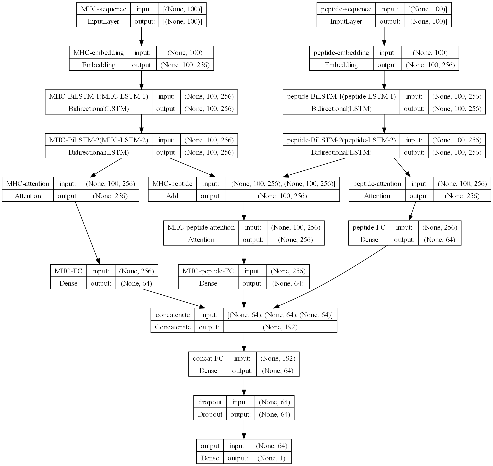
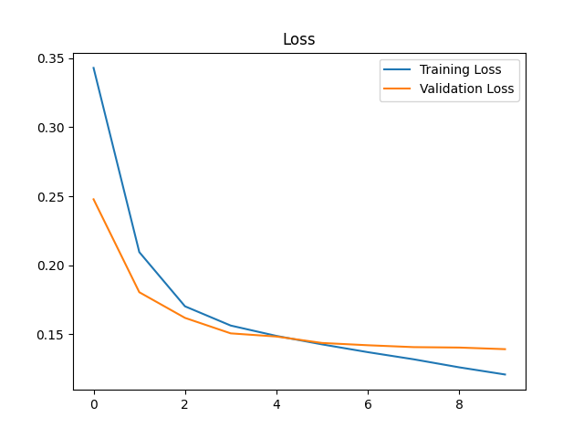
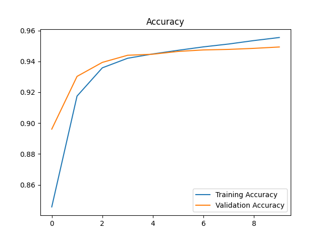
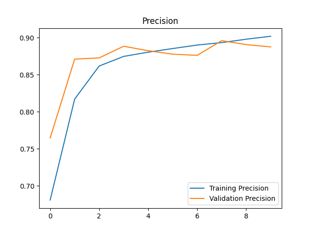
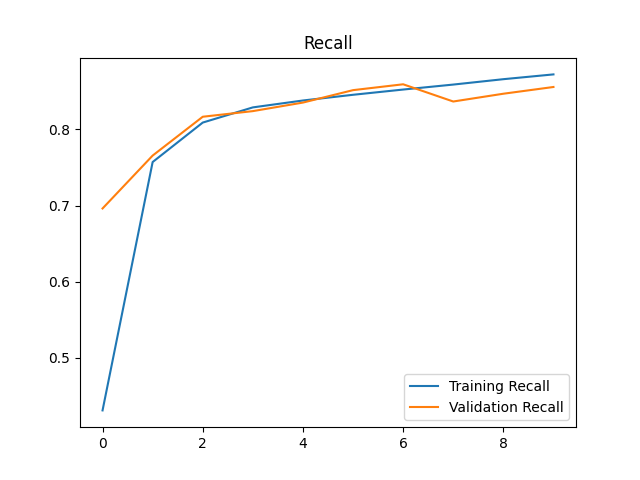
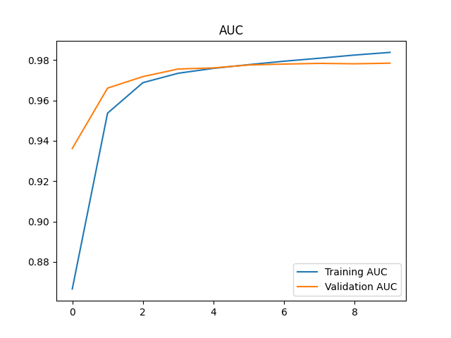

# Binding Affinity Prediction

## Preprocess

```bash
python Preprocess.py -f [CSV path] -v [validation ratio] -t [test ratio] -tp [train path] -vp [validation path] -tep [test path]
```

This splits the data into train, validation and test sets. The default validation and test ration is 15%.

## Train

```bash
python main.py --train [train path] --val [validation path] -e [epochs] -b [batch size] -lr [learning rate] -l [loss function] -ed [embedding dimension] -ru [RNN units] -s [sequence length] -v [vocab size] -fci [inner FC units] -fco [outer FC units] -cd [context dim] -m [model name]
```

First run preprocesing to generate train, val, test splits.

## Architecture

I follow a variant of the architecure in [MHCAttnNet](https://github.com/gopuvenkat/MHCAttnNet/tree/master).

The best model follows the following architecture:(mhcAttentionAdd)

1. MHC and peptide sequences are each embedded into 256 dimensional vectors.
2. Each embedded sequences are fed into 2 bidirectional LSTM layers with 128 units each.
3. Now the following 3 sequences are passed into attention layers:
    1. The MHC LSTM output
    2. The peptide LSTM output
    3. The sum of MHC and peptide LSTM outputs
4. The attention outputs are each passed through fully connected layers with 64 units.
5. The outputs of the fully connected layers are concatenated and passed through a sequence of fully connected layers to get the final output.

Here is a diagram of the model:



Other models I tried are:

1. (mhcAttentionConcat) Concatenating the LSTM outputs instead of adding them.
2. (mhcAttentionCombined) Only the concatenated LSTM outputs are passed through the attention layer.
3. (mhcAttentionSimple) Only the LSTM outputs are passed through the attention layer.
4. (mhcNoAttention) No attention layer is used. The LSTM outputs are passed through global average pooling and then through fully connected layers.

## Results

The best model is mhcAttentionAdd. The results are as follows:(On test set with 15% ratio)

| Model | Loss | Accuracy | Precision | Recall | F1 Score | AUC |
| ----- | ---- | -------- | --------- | ------ | -------- | --- |
| mhcAttentionAdd | 0.1392 | 94.91 | 88.87 | 85.48 | 87.14 | 97.85 |

## Training Plots

<div style="text-align: center;">
    <div style="display: flex;">
        <div style="flex: 1;">
            
            <p>Loss</p>
        </div>
        <div style="flex: 1;">
            
            <p>Accuracy</p>
        </div>
        <div style="flex: 1;">
            
            <p>Precision</p>
        </div>
        <div style="flex: 1;">
            
            <p>Recall</p>
        </div>
        <div style="flex: 1;">
            
            <p>AUC</p>
        </div>
    </div>
</div>
